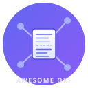

<p align="center">
  <picture>
    <source media="(prefers-color-scheme: dark)" srcset="assets/logo-dark.svg">
    
  </picture>
</p>

<p align="center">
  <h1 align="center">Awesome OKF</h1>
</p>

<p align="center">
  <strong>Каталог избранных ресурсов по Open Knowledge Format.</strong>
</p>

<p align="center">
  Данные в YAML. Поиск для агентов. Наполняется сообществом.
</p>

<p align="center">
  <a href="https://github.com/Albertchamberlain/Awesome-OKF"></a>
  <a href="LICENSE"></a>
  
  
</p>

<p align="center">
  <a href="README.md">English</a> | <a href="README.zh.md">中文</a> | <a href="README.ja.md">日本語</a> | <a href="README.ko.md">한국어</a> | <b>Русский</b>
</p>

<br>

<p align="center">
  <a href="#каталог"><b>Каталог</b></a> &ensp;·&ensp;
  <a href="#подключение-к-агенту"><b>Подключение к агенту</b></a> &ensp;·&ensp;
  <a href="#cli"><b>CLI</b></a> &ensp;·&ensp;
  <a href="#участие-в-проекте"><b>Участие в проекте</b></a>
</p>

<br>

---

## Что такое OKF

[Open Knowledge Format (OKF)](https://github.com/GoogleCloudPlatform/knowledge-catalog/blob/main/okf/SPEC.md) — открытая спецификация от Google Cloud. Знания описываются как папка с файлами Markdown, у которых есть YAML frontmatter, плюс небольшой набор соглашений. Не нужны ни среда выполнения, ни SDK.

## Чем отличается этот проект

Awesome OKF хранит всю экосистему OKF в **одном YAML-каталоге с проверкой данных**. Из него получаются список для чтения, CLI с поиском и метасервер MCP, к которому ИИ-агенты могут обращаться напрямую:

<div align="center">

```
                      catalog.yaml
                           │
          ┌────────────────┼────────────────┐
          ▼                ▼                 ▼
      README.md        Утилиты CLI       Сервер MCP
     (для чтения)      (с поиском)     (для агентов)
```

</div>

> **Измените одну запись. Пересоберите документацию. Запрашивайте данные откуда угодно.**

---

## 🌐 OKF Anything

**Всё, что можно прочитать, можно превратить в OKF.** Любой поддерживаемый формат, как и любой придуманный вами, сначала приводится к одной промежуточной структуре, а затем собирается в OKF:

```
        ┌──────── ИЗВЛЕЧЕНИЕ ─────────┐   ┌─ НОРМАЛИЗАЦИЯ ─┐   ┌──── СБОРКА ────┐
        │  Markdown · Typora · PDF    │   │  title         │   │  # заголовок   │
        │  Obsidian · Notion · Feishu │ → │  url           │ → │  описание      │
        │  GitHub · JSON · YAML       │   │  description   │   │  ресурс        │
        │  CSV · ключ-значение · OCR  │   │  body / tags   │   │  для myokf     │
        └─────────────────────────────┘   └────────────────┘   └────────────────┘
```

1. **Извлечение**: из любого источника достаётся читаемый текст. Для этого используются штатный экспорт платформ и локальные движки (pymupdf, PaddleOCR). **Через нашу модель ничего не проходит**.
2. **Нормализация**: любой формат сводится к полям `title / url / description` (и необязательным `body`, `tags`).
3. **Сборка**: из промежуточной структуры получается папка OKF, которую можно проверить через myokf.

`--format anything` делает то же самое автоматически: передайте произвольный текст, и он пройдёт по цепочке парсеров (список → JSON → ключ-значение → URL → построчно), пока один из них не подойдёт:

```bash
python scripts/convert-to-okf.py whatever.txt --format anything -o kb/
```

Инструмент MCP `convert_to_okf` работает так же: агент передаёт произвольный текст и получает обратно OKF.

---

## Как это выглядит

```text
Пользователь (или агент):
  "Найди плагин OKF для конвертации хранилища Obsidian."

Агент вызывает:
  search_catalog({
    "query": "Obsidian",
    "kind": "plugin",
    "limit": 3
  })

Awesome-OKF отвечает:
  ┌──────────────────────────────────────────────────────────────┐
  │ obsidian-to-okf                                plugin        │
  │ Конвертирует хранилища Obsidian в OKF, wikilinks → ссылки.   │
  │ Платформа: python  ·  Теги: obsidian, wikilink, markdown     │
  └──────────────────────────────────────────────────────────────┘
```

*Каталог говорит на языке OKF.*

---

## Быстрый старт

### Подключение к агенту

Добавьте Awesome OKF в любой MCP-клиент, чтобы ваш агент мог находить ресурсы OKF:

```bash
pipx install awesome-okf
```

```json
{
  "mcpServers": {
    "awesome-okf": {
      "command": "awesome-okf-server"
    }
  }
}
```

### CLI

```bash
awesome-okf stats
awesome-okf list --kind plugin
awesome-okf search obsidian
awesome-okf readme
```

---

## 🛠️ Наши инструменты

### convert-to-okf 🔄

CLI без зависимостей. Превращает содержимое с привычных вам платформ в наборы знаний OKF:

| 📥 Формат на входе | ✨ Что делает |
|---|---|
| 📋 Списки awesome-xx в Markdown | Извлекает пункты вида `- [Title](URL) — Description` → записи OKF |
| 📊 Массивы JSON | Преобразует объекты `{title, url, description}` → записи OKF |
| 🔗 Списки URL | Обычный текстовый список адресов → записи OKF |
| 🧾 Файлы YAML | Списки и словари с полями `{title, url, description}`. Нужен pyyaml (необязательная зависимость) |
| 📑 Таблицы CSV | Столбцы `title/url/description`. Если столбца title нет, берётся первый столбец |
| 🗂️ Текст «ключ-значение» | Блоки вида `key: value`: frontmatter, файлы properties, собственные форматы |
| 🐙 Репозитории GitHub | Укажите ссылку на репозиторий: метаданные и README загружаются на лету → запись OKF |
| 📓 Хранилища Obsidian | Локальная папка хранилища → одна запись на заметку, wikilinks преобразуются в ссылки |
| 📝 Экспорт из Notion | Папка, полученная через «Export → Markdown» → одна запись на страницу |
| 🦩 Документы Feishu | Markdown, экспортированный из Feishu → одна запись на документ |
| 🖋️ Заметки Typora | Обычные файлы `.md`: достаточно указать файл или папку |
| 📕 Документы PDF | Текстовый слой извлекается через pymupdf (необязательная зависимость). Для сканов выводится инструкция по OCR |
| 🖼️ Сканы и изображения | Встроенного OCR нет. Вместо этого выводится готовая инструкция для PaddleOCR |

```bash
# Любая платформа, одна команда
python scripts/convert-to-okf.py README.md -o kb/ -t concept
python scripts/convert-to-okf.py https://github.com/GoogleCloudPlatform/knowledge-catalog --format github -o kb/
python scripts/convert-to-okf.py my-vault/ --format obsidian -o kb/
python scripts/convert-to-okf.py notion-export/ --format notion -o kb/
python scripts/convert-to-okf.py feishu-doc.md --format feishu -o kb/

# Структурированные данные
python scripts/convert-to-okf.py data.yaml --format yaml -o kb/   # нужно: pip install pyyaml
python scripts/convert-to-okf.py table.csv --format csv -o kb/
python scripts/convert-to-okf.py notes.properties --format kv -o kb/

# PDF с текстовым слоем
pip install pymupdf
python scripts/convert-to-okf.py paper.pdf --format pdf -o kb/

# Сканы и PDF из картинок → OKF: сначала OCR (ваш локальный движок, не наша модель), затем конвертация
python scripts/convert-to-okf.py scan.png --format image    # выводит инструкцию по OCR
pip install paddleocr paddlepaddle
paddleocr ppocr -i scans/ --type ocr --lang en -o ocr-text/
python scripts/convert-to-okf.py ocr-text/ --format notion -o kb/

# Результат: папка kb/ с файлами Markdown, у каждого есть YAML frontmatter
# Дальше можно запускать: myokf validate kb/
```

### awesome-okf CLI 🎛️

CLI для работы с каталогом. Всё содержимое берётся из `catalog.yaml`, архитектура та же, что у Awesome-MCP:

| 🔍 Команда | 📝 Назначение |
|---|---|
| `awesome-okf search obsidian` | Полнотекстовый поиск по всем 29 записям |
| `awesome-okf list --kind plugin` | Фильтр по типу записи |
| `awesome-okf readme` | Пересобрать README из catalog.yaml |
| `awesome-okf-server` | Метасервер MCP: через него ИИ-агенты обращаются к каталогу |

---

## 🔥 Популярные репозитории

| 🏆 Репозиторий | 📌 Что в нём есть |
|---|---|
| ⭐ [yzfly/awesome-okf](https://github.com/yzfly/awesome-okf) | Первый ресурс по OKF на китайском языке: 7 плагинов, 7 навыков (skills) и 3 предложения (proposals) |
| ⭐ [linyiru/awesome-okf](https://github.com/linyiru/awesome-okf) | Собрание ресурсов по OKF на английском: спецификация, инструменты, примеры, руководства |
| 📚 [GoogleCloudPlatform/knowledge-catalog](https://github.com/GoogleCloudPlatform/knowledge-catalog) | Официальная спецификация OKF, SDK и предложения от Google |
| 🧠 [karpathy/llm-wiki](https://github.com/karpathy/llm-wiki) | Та самая LLM Wiki, с которой начался OKF |

---

## Каталог

> **29 отобранных записей** · 4 инструмента · 7 плагинов · 7 навыков · 5 предложений · 6 документов
> *Это осознанная подборка, а не полный перечень.*

<!-- CATALOG:TOOLS:START -->

<!-- CATALOG:TOOLS:END -->

<!-- CATALOG:PLUGINS:START -->

<!-- CATALOG:PLUGINS:END -->

<!-- CATALOG:SKILLS:START -->

<!-- CATALOG:SKILLS:END -->

<!-- CATALOG:PROPOSALS:START -->

<!-- CATALOG:PROPOSALS:END -->

<!-- CATALOG:DOCS:START -->

<!-- CATALOG:DOCS:END -->

---

## Модель данных

```yaml
- id: obsidian-to-okf
  name: obsidian-to-okf
  kind: plugin
  category: document
  url: https://github.com/yzfly/awesome-okf/tree/main/plugins/obsidian-to-okf
  description: Convert Obsidian vaults to OKF — wikilinks become OKF links.
  platform: [python]
  official: false
  tags: [obsidian, wikilink, markdown]
```

---

## Участие в проекте

Добавьте или измените записи в [`data/catalog.yaml`](data/catalog.yaml), затем выполните:

```bash
awesome-okf validate
awesome-okf readme
pytest
```

Схема записи описана в [`CONTRIBUTING.md`](CONTRIBUTING.md).

---

## 🤖 Для ИИ-агентов

Если вы ИИ-агент (Claude Code, Codex, Cursor) и работаете с этим репозиторием, вот что нужно знать:

### Структура проекта

```
data/catalog.yaml          # ЕДИНСТВЕННЫЙ ИСТОЧНИК ДАННЫХ: все записи хранятся здесь
README.template.md         # английский шаблон (текст пишется вручную)
README.template.zh.md      # китайский шаблон
README.template.ja.md      # японский шаблон
README.template.ko.md      # корейский шаблон
README.template.ru.md      # русский шаблон
src/awesome_okf/           # CLI и метасервер MCP (Python)
scripts/convert-to-okf.py  # утилита конвертации форматов
```

### Правила (обязательные)

1. **Никогда не редактируйте README\*.md напрямую**: эти файлы генерируются. Измените `data/catalog.yaml` и пересоберите их.
2. **Никогда не редактируйте блоки CATALOG** в шаблонах: всё между маркерами `<!-- CATALOG:*:START/END -->` генерируется автоматически.
3. **Чтобы добавить запись**, допишите блок YAML в `data/catalog.yaml`, пересоберите README и запустите тесты. Схема:
   ```yaml
   - id: kebab-case-id          # уникальный, повторно не используется
     name: Human Readable Name
     kind: tool|plugin|skill|proposal|doc
     category: free-form-group
     url: https://...
     description: One sentence, no marketing fluff.
     platform: [cli|python|web|claude-code]
     official: false            # true ТОЛЬКО для официальных проектов Google или вендора
     tags: [3-5 short tags]
   ```
4. **Проверяйте перед коммитом**: `awesome-okf validate && pytest`
5. **Никогда не создавайте дубликаты id**: редактируйте существующую запись.
6. **Несколько языков**: если меняете один шаблон, внесите то же изменение во все пять шаблонов.

### Полезные команды

```bash
awesome-okf stats                    # число записей по типам
awesome-okf list --kind plugin       # фильтр по типу
awesome-okf search <query>           # полнотекстовый поиск
awesome-okf validate                 # проверка схемы и дубликатов id
awesome-okf readme                   # пересобрать все README
awesome-okf-server                   # метасервер MCP (stdio)
```

### Метасервер MCP

Каталог доступен агентам через `awesome-okf-server`. Сервер предоставляет пять инструментов:
`search_catalog`, `list_catalog`, `get_catalog_entry`, `catalog_stats`, `convert_to_okf`.
Подключите его к своему MCP-клиенту, чтобы запрашивать ресурсы OKF из кода.

---


## Похожие списки

- [yzfly/awesome-okf](https://github.com/yzfly/awesome-okf) — первое собрание ресурсов по OKF, на китайском языке
- [Спецификация OKF](https://github.com/GoogleCloudPlatform/knowledge-catalog/blob/main/okf/SPEC.md) — официальная спецификация от Google Cloud

---

<br>

<p align="center">
  <sub>Лицензия MIT, см. <a href="LICENSE">LICENSE</a>. Описания в каталоге ведут на исходные проекты, у каждого из которых своя лицензия.</sub>
</p>